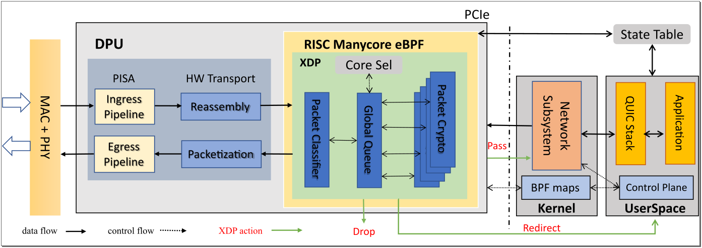

QUIC is a new transmission protocol parallel with TCP. Compared with TCP, QUIC has advantages over TCP, but still apparent bottlenecks need to be optimized. The optimization method follows the TCP research route. The mainstream is the hardware offloading technology, which offloads the computing-intensive functional modules to the network equipment, and the hardware processing replaces the host CPU for computing. However, the performance of hardware offloading is high, but the versatility and programmability are not guaranteed. To overcome the limitation above, we proposed a software offloading model named NanoBPF, based on the offloading protocol model of RISC multicore in DPU. The model modified the boot code of the bootloader, guided and activated the BPF code as run time environment, and offloaded the QUIC's cryption functional module, which is high CPU occupancy. The model prototype is verified by dual host interconnection and Docker-based simulation topology. Experimental results showed that the offloading of en/decryption improved the throughput by nearly 13% and guaranteed fairness with TCP under certain conditions.

